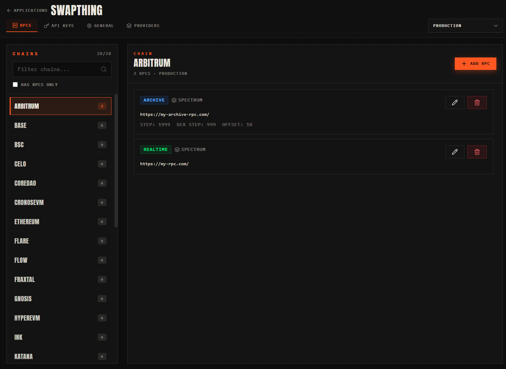

# Farsight.Rpc

**Farsight.Rpc** is a small control plane for blockchain RPC infrastructure. It lets you register RPC providers, attach **realtime**, **archive**, and **tracing** endpoints per chain, and scope that configuration to **consumer applications** and **host environments** (for example dev vs production). Consumer services resolve the right URLs at runtime using environment-scoped API keys—no hard-coded RPC lists in your apps.



## What’s in the repo

| Piece | Role |
|--------|------|
| **`src/api`** | ASP.NET Core service (FastEndpoints), PostgreSQL via EF Core, JWT auth for admin flows |
| **`src/types`** | Shared JSON/DTO contracts (`RpcEndpointDto`, providers, headers) |
| **`sdk/csharp`** | Read-only .NET client that calls `GET /api/Rpcs` with your API key |
| **`src/ui`** | SolidJS + Vite + Tailwind admin front end |
| **`docker/`** | Dockerfiles for API and UI |

## SDKs

The SDKs return RPC endpoints grouped by chain plus provider metadata (name, rate limit). Configure base URL and API key once, then call the client when you need fresh configuration.

### C# (`Farsight.Rpc.Sdk`)

```csharp
builder.AddFarsightRpc(options =>
{
    options.ApiUrl = new Uri("https://your-farsight-rpc-host/");
    options.ApiKey = "your-environment-scoped-api-key";
});

var client = serviceProvider.GetRequiredService<IFarsightRpcClient>();
var result = await client.GetRpcsAsync();

if (result is IFarsightRpcClient.GetRpcsResult.Success ok)
{
    // ok.Rpcs: chain name → endpoints (Realtime / Archive / Tracing)
    // ok.Providers: referenced providers
}
```

More detail and edge cases live in [`src/sdk/README.md`](src/sdk/README.md).

---

*Version is driven by `version.props` (currently 1.0.0).*
