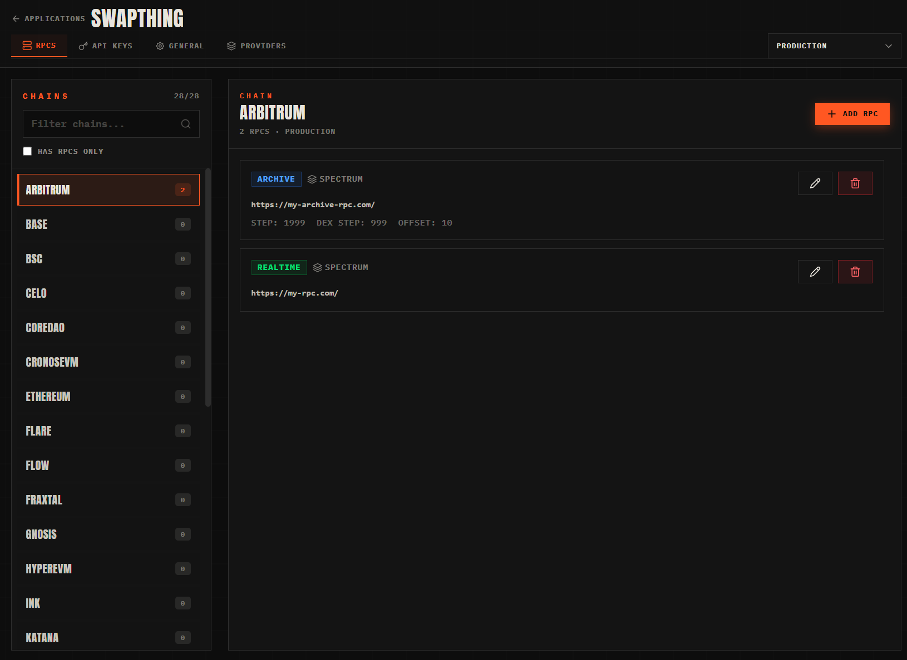

# Farsight.Rpc

**Farsight.Rpc** is a small control plane for blockchain RPC infrastructure. It lets you register RPC providers, attach **realtime**, **archive**, and **tracing** endpoints per chain, and scope that configuration to **consumer applications** and **host environments** (for example dev vs production). Consumer services resolve the right URLs at runtime using environment-scoped API keys—no hard-coded RPC lists in your apps.



## What’s in the repo

| Piece | Role |
|--------|------|
| **`src/api`** | ASP.NET Core service (FastEndpoints), PostgreSQL via EF Core, JWT auth for admin flows |
| **`src/types`** | Shared JSON/DTO contracts (`RpcEndpointDto`, providers, headers) |
| **`sdk/csharp`** | Read-only .NET client that calls `GET /api/Rpcs` with your API key |
| **`src/ui`** | SolidJS + Vite + Tailwind admin front end |
| **`docker/`** | Dockerfiles for API and UI |

## Admin users

Admin login credentials are configured as a list in the API's `AdminLogin` configuration section. Every configured user has the same administrator access. Passwords are configured as SHA-256 hashes instead of plaintext.

```json
{
  "AdminLogin": {
    "Users": [
      {
        "Username": "alice",
        "PasswordHash": "17a96502d336e4c18a43182a353d7f0a38414c6fc4daf678acae834a819cecee"
      },
      {
        "Username": "bob",
        "PasswordHash": "df53c27a66157885ba143e34f25d6380e12168b0f7da4f0c46efa54cd9a083b7"
      }
    ]
  }
}
```

Generate each value with any standard SHA-256 tool. For example, on Linux:

```bash
printf %s 'your-password' | sha256sum
```

## SDKs

The SDKs return RPC endpoints grouped by chain plus provider metadata (name, rate limit).

### C# (`Farsight.Rpc.Sdk`)

```csharp
builder.AddFarsightRpc(options =>
{
    options.ApiUrl = new Uri("https://your-farsight-rpc-host/");
});

var client = serviceProvider.GetRequiredService<IFarsightRpcClient>();
var result = await client.GetRpcsAsync("your-environment-scoped-api-key");

if (result is IFarsightRpcClient.GetRpcsResult.Success ok)
{
    // ok.Rpcs: chain metadata -> endpoints (Realtime / Archive / Tracing)
    // ok.Providers: referenced providers
}

var signResult = await client.SignAsync(
    "your-wallet-api-key",
    dataToSign
);

if (signResult is IFarsightRpcClient.SignResult.Success signed)
{
    byte[] signature = signed.Signature;
}

IEtherSigner signer = new FarsightEtherSigner(
    client,
    "your-wallet-api-key",
    Address.Parse("0x0123456789abcdef0123456789abcdef01234567")
);
```

More detail and edge cases live in [`sdk/csharp/README.md`](sdk/csharp/README.md).

---

*The .NET SDK version is driven by `version.props` (currently 1.0.0).*
